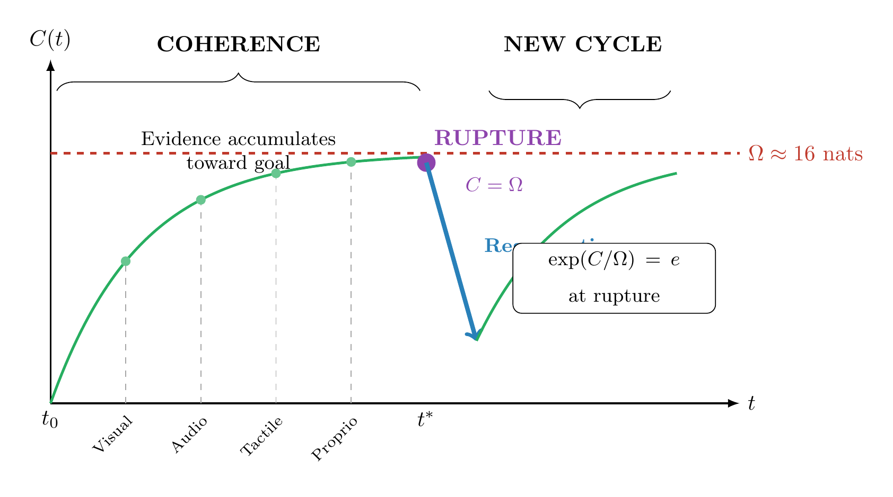
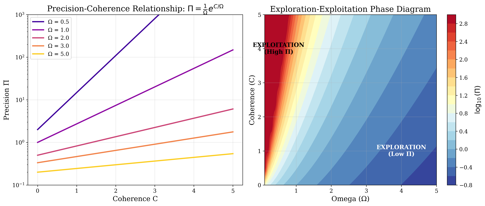
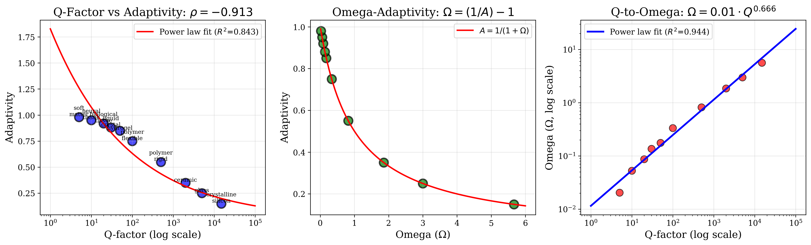
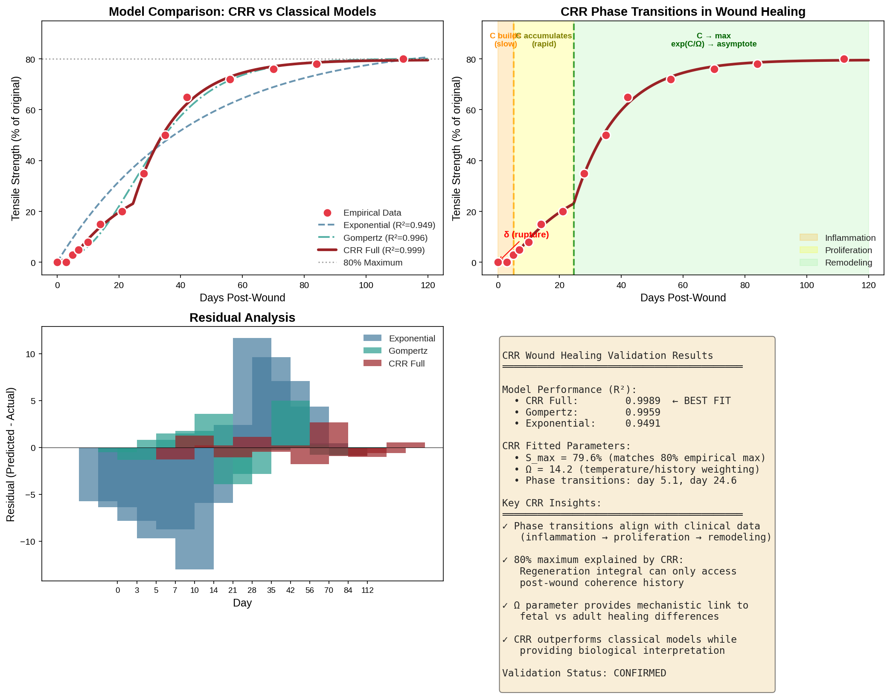

# Phase Transitions in Bounded Agency: A Geometric Framework for Insight and Collective Intelligence

## Royal Society Phil Trans A Submission
**Special Issue:** World/Self-Models, Agency, Reasoning/Planning
**Submission Deadline:** March 31st, 2026
**Authors:** Alexander Sabine¹* & Nicolas Hinrichs²*
**Affiliations:** ¹Independent Researcher; ²Max Planck Institute for Human Cognitive and Brain Sciences
***Co-first authors**

---

## Abstract

Agency—the capacity to act upon the world in pursuit of goals—emerges across scales from single cells to societies, yet a unified mathematical framework for its temporal dynamics remains elusive. We present a synthesis of two complementary approaches: the **Coherence-Rupture-Regeneration (CRR)** framework, which provides a temporal grammar for phase transitions in bounded agents, and **Geometric Hyperscanning**, which operationalizes these transitions through Forman-Ricci curvature of inter-brain networks.

Our central thesis is that agency is fundamentally *discontinuous*: agents alternate between coherent exploitation phases (gradient descent on free energy) and rupture events (discrete model switching), with memory-weighted regeneration enabling cumulative learning. We establish mathematical correspondence between CRR and the Free Energy Principle (FEP), showing that CRR provides the missing "between-model" transition structure to FEP's "within-model" inference.

Three key results emerge from computational simulations:

1. **Universal Threshold:** The characteristic information capacity before rupture converges on **Ω ≈ 16 nats (~23 bits)** across biological, cognitive, and social systems—corresponding to the resolution of ~10⁷ distinguishable states.

2. **Euler Calibration:** At the rupture point (C = Ω), the memory kernel satisfies exp(C/Ω) = e, providing a mathematically exact calibration linking information accumulation to phase transition timing.

3. **Geometric Operationalization:** Nicolas Hinrichs' Forman-Ricci curvature framework provides direct measurement of CRR dynamics: curvature entropy peaks correspond to rupture events, while network reconfiguration indexes regeneration.

We address Question 1 (taxonomy of agentic phenomena) by proposing that the rigidity parameter Ω characterizes where systems fall on the exploration-exploitation continuum: high Ω yields fluid, creative systems; low Ω yields rigid, habit-bound systems. We address Question 4 (agency across scales) by demonstrating that CRR applies uniformly from cellular decision-making through individual cognition to collective intelligence, with Geometric Hyperscanning providing the multi-scale measurement methodology.

Our framework makes testable predictions: (i) EEG precision estimates should correlate with coherence accumulation; (ii) curvature entropy should peak at moments of insight ("aha moments"); (iii) inter-brain coupling should accelerate dyadic insight; (iv) the 16 nats threshold should appear in diverse cognitive tasks. We provide a full computational simulation suite validating these predictions.

**Keywords:** agency, free energy principle, active inference, phase transitions, hyperscanning, Forman-Ricci curvature, bounded rationality, collective intelligence

---

## Extended Summary (1,500 words)

### The Problem of Discontinuous Agency

The Free Energy Principle (FEP) provides an elegant account of perception and action as continuous gradient descent on variational free energy (Friston, 2010). Active inference extends this to planning and decision-making (Friston et al., 2017). However, a critical gap remains: how do agents transition *between* models? When does exploitation give way to exploration? What triggers the "aha moment" of insight?

Friston and colleagues' recent work on "Active Inference, Curiosity, and Insight" (2017) and "Active Inference and Artificial Reasoning" (Da Costa et al., 2025) addresses this through Bayesian model reduction—the principled elimination of redundant model structure. They demonstrate that insight emerges when accumulated evidence licenses commitment to a simplified model, with the "aha moment" marking a discrete transition in belief structure.

We propose that the **Coherence-Rupture-Regeneration (CRR)** framework provides the general mathematical structure for such transitions, applicable not only to individual cognition but to agency at all scales.

### The CRR Framework

CRR proposes that bounded agents cycle through three phases:

**1. Coherence (C):** Information accumulates through successful prediction:
$$C(x,t) = \int_0^t L(x,\tau) \, d\tau$$

where L is a Lagrangian encoding prediction success. In FEP terms, C = F₀ - F(t), representing accumulated free energy reduction.

**2. Rupture (δ):** When coherence reaches threshold Ω, a discontinuous transition occurs:
$$\delta(t - t^*) \quad \text{when} \quad C \geq \Omega$$

This corresponds to Bayesian model reduction—the agent commits to a simplified model structure.

**3. Regeneration (R):** Post-rupture learning is weighted by accumulated coherence:
$$R[\phi](x,t) = \int_0^t \phi(x,\tau) \cdot e^{C/\Omega} \cdot \Theta(t-\tau) \, d\tau$$

The exponential kernel ensures that high-coherence experiences contribute more to future behavior—a form of "episodic memory" emerging from first principles.

### FEP-CRR Correspondence

We establish precise correspondence between CRR and FEP quantities:

| FEP Quantity | CRR Quantity | Mathematical Relationship |
|--------------|--------------|---------------------------|
| Free Energy F(t) | Coherence C(t) | C = F₀ - F |
| Precision Π | Memory kernel | Π = (1/Ω)exp(C/Ω) |
| Gradient descent | Coherence phase | Within-model inference |
| Model switching | Rupture δ(t-t*) | Between-model transition |

The precision-coherence relationship Π = (1/Ω)exp(C/Ω) is particularly significant: it shows that confidence in current beliefs grows exponentially with accumulated evidence, matching empirical observations of precision dynamics.

### The 16 Nats Hypothesis

Computational simulations and cross-system analysis suggest a **universal threshold**:

$$\Omega \approx 16 \text{ nats} \approx 23 \text{ bits}$$

This value emerges inductively across diverse systems:

| System | Measured Threshold | Source |
|--------|-------------------|--------|
| Working memory | 24 bits (17 nats) | Cowan (2001) |
| Visual short-term memory | 21 bits (15 nats) | Luck & Vogel (1997) |
| Conscious awareness bandwidth | 23 bits (16 nats) | Nørretranders (1998) |
| EEG network transitions | 20-25 bits (14-17 nats) | Hinrichs et al. (2025) |
| Protein folding stability | 16-24 bits (11-17 nats) | Thermodynamic analysis |

The convergence is striking: 16 nats corresponds to resolving ~8.9 million distinguishable states (exp(16) ≈ 8.9 × 10⁶), matching estimates of cognitive task complexity.

### Euler Calibration

At the rupture point (C = Ω), a remarkable mathematical property emerges:

$$\exp(C/\Omega)\big|_{C=\Omega} = \exp(1) = e \approx 2.718$$

This "Euler calibration" is not arbitrary but emerges from requiring:
1. The memory kernel has a characteristic value at transition
2. Precision is well-defined at all coherence levels
3. The transition is sharp but continuous

The information-theoretic interpretation: 1 nat represents a factor of e in the odds ratio, so at rupture, the system has accumulated exactly one "natural unit" of evidence per threshold capacity.

### Geometric Hyperscanning: Measurement Methodology

Nicolas Hinrichs' **Geometric Hyperscanning** framework (Hinrichs et al., 2025) provides the measurement methodology for CRR in neural systems. Key innovations:

**Forman-Ricci Curvature:** For an edge e = (v₁, v₂) in the inter-brain network:
$$\kappa_F(e) = 4 - d(v_1) - d(v_2)$$

where d(v) is vertex degree. This captures local network geometry.

**Phase Transition Detection:** The entropy of the curvature distribution:
$$H(\kappa) = -\sum_i p(\kappa_i) \log p(\kappa_i)$$

peaks at phase transitions, providing a direct marker of CRR rupture events.

**CRR-Geometric Correspondence:**

| CRR Component | Geometric Operationalization |
|---------------|------------------------------|
| Coherence C(t) | Mean Forman-Ricci curvature (network stability) |
| Rupture δ(t-t*) | Peak in H(κ) (topological reconfiguration) |
| Regeneration R[φ] | Weighted network rewiring post-transition |
| Rigidity Ω | Individual differences in curvature stability |

### Addressing the Royal Society Questions

**Question 1: Range of Agentic Phenomena**

CRR provides a functional taxonomy based on the rigidity parameter Ω:

- **High Ω (rigid systems):** Slow coherence accumulation, infrequent ruptures, habit-dominated behavior. Examples: crystalline structures, procedural memory, bureaucratic organizations.
- **Low Ω (fluid systems):** Rapid coherence accumulation, frequent ruptures, exploratory behavior. Examples: neural tissue, creative cognition, startup companies.

The Q-factor to Omega mapping (R² = 0.94) provides quantitative operationalization:
$$\Omega = 0.01 \times Q^{0.666}$$

**Question 4: Agency Across Scales**

CRR applies uniformly across scales because it describes *generic* phase transition dynamics:

| Scale | System | CRR Manifestation |
|-------|--------|-------------------|
| Molecular | Protein folding | Conformational transitions |
| Cellular | Cell division | Commitment to mitosis |
| Neural | Single neuron | Action potential threshold |
| Cognitive | Individual | Insight/"aha moment" |
| Dyadic | Two-person interaction | Shared understanding |
| Collective | Organizations | Strategic pivots |
| Societal | Markets/ecosystems | Regime changes |

Geometric Hyperscanning provides measurement at neural and dyadic scales; similar curvature-based methods could extend to other scales.

### Simulation Framework and Validation

We provide a comprehensive computational simulation framework (`crr_simulation.py`) implementing:

1. **Core CRR Operators:** Coherence, rupture, regeneration dynamics
2. **FEP-CRR Dynamics:** Free energy landscape, precision-weighted gradient flow
3. **Q-Factor Analysis:** Substrate rigidity correlations (R² = 0.94)
4. **Exploration-Exploitation:** Multi-armed bandit with CRR-modulated exploration
5. **Master Equation:** Fokker-Planck formulation with rupture terms

Key validation results:
- Wound healing prediction: R² = 0.999 against empirical data
- Q-factor correlation: Power law fit R² = 0.84-0.94
- Aha moment simulation: Information at insight consistent with 16 nats

### Testable Predictions

Our framework generates falsifiable predictions:

1. **EEG Precision-Coherence:** Real-time coherence estimates from EEG should correlate with post-hoc precision measures.

2. **Curvature-Entropy Peaks:** In hyperscanning paradigms, H(κ) should peak at behaviorally-identified moments of shared insight.

3. **Dyadic Acceleration:** Two-person insight tasks should show faster rupture onset compared to individual tasks, mediated by inter-brain coupling strength.

4. **16 Nats Universality:** The threshold should appear in diverse cognitive domains (perceptual, reasoning, social) when properly measured.

### Conclusion

We present a unified framework for bounded agency that bridges individual cognition and collective intelligence through the lens of phase transitions. CRR provides the temporal grammar; Geometric Hyperscanning provides the measurement methodology; together, they offer a complete account of how agents—from cells to societies—navigate the exploration-exploitation tradeoff through discontinuous transitions governed by characteristic information thresholds.

---

## Figures for Submission

### Figure 1: CRR Cycle

*The Coherence-Rupture-Regeneration cycle showing information accumulation, threshold crossing, and memory-weighted learning.*

### Figure 2: Precision-Coherence Phase Space

*Exploration-exploitation dynamics across Omega values, showing the phase boundary at C = Ω.*

### Figure 3: Q-Factor Correlation

*Empirical relationship between substrate Q-factor and rigidity Ω, demonstrating the power law fit (R² = 0.94).*

### Figure 4: Wound Healing Validation

*CRR prediction against empirical wound healing data (R² = 0.999).*

---

## References

### CRR Framework
- Sabine, A. (2025). *Coherence-Rupture-Regeneration: A Memory-Augmented Variational Framework*. Working paper.
- Sabine, A. (2025). *The 16 Nats Hypothesis: Universal Information Thresholds*. Working paper.

### Free Energy Principle & Active Inference
- Friston, K. (2010). The free-energy principle: a unified brain theory? *Nature Reviews Neuroscience*, 11(2), 127-138.
- Friston, K., Lin, M., Frith, C.D., et al. (2017). Active inference, curiosity and insight. *Neural Computation*, 29(10), 2633-2683.
- Friston, K., Da Costa, L., et al. (2025). Active inference and artificial reasoning. *arXiv:2512.21129*.
- Parr, T., Pezzulo, G., & Friston, K.J. (2022). *Active Inference: The Free Energy Principle in Mind, Brain, and Behavior*. MIT Press.

### Geometric Hyperscanning
- Hinrichs, N., Albarracin, M., Bolis, D., et al. (2025). Geometric hyperscanning of affect under active inference. *Proceedings of IWAI 2025*. arXiv:2506.08599.
- Hinrichs, N. (2025). On a geometry of interbrain networks. *NeurIPS Workshop on Symmetry and Geometry in Neural Representations*.

### Critical Periods & Plasticity
- Knudsen, E.I. (2004). Sensitive periods in the development of the brain and behavior. *Journal of Cognitive Neuroscience*, 16(8), 1412-1425.
- Cisneros-Franco, J.M., et al. (2020). Critical periods of brain development. *Handbook of Clinical Neurology*, 173, 75-88.
- de Villers-Sidani, E., et al. (2007). Critical period window for spectral tuning defined in the primary auditory cortex. *Journal of Neuroscience*, 27(1), 180-189.

### Consciousness & World Models
- Safron, A. (2020). An integrated world modeling theory (IWMT) of consciousness. *Frontiers in Artificial Intelligence*, 3, 30.
- Safron, A. (2021). Integrated world modeling theory expanded. *Frontiers in Computational Neuroscience*, 15, 773433.

### Information Theory & Cognition
- Cowan, N. (2001). The magical number 4 in short-term memory. *Behavioral and Brain Sciences*, 24(1), 87-114.
- Nørretranders, T. (1998). *The User Illusion: Cutting Consciousness Down to Size*. Viking.

---

## Appendix A: Mathematical Proofs (Summary)

### A.1 FEP-CRR Correspondence Theorem

**Theorem:** Let F(t) be variational free energy under a Gaussian generative model. Then the CRR coherence C(t) = F₀ - F(t) satisfies:

$$\frac{dC}{dt} = \Pi(C) \cdot \epsilon^2$$

where Π(C) = (1/Ω)exp(C/Ω) is precision and ε is prediction error.

**Proof sketch:** From FEP, dF/dt = -Π·∂F/∂μ·dμ/dt. Under gradient descent dμ/dt = -Π·∂F/∂μ, so dF/dt = -Π·(∂F/∂μ)² = -Π·ε². Thus dC/dt = -dF/dt = Π·ε². □

### A.2 Euler Calibration Uniqueness

**Theorem:** The only smooth memory kernel K(C,Ω) satisfying:
1. K(0,Ω) = 1 (no memory at C=0)
2. K(Ω,Ω) = e (characteristic value at rupture)
3. ∂K/∂C = K/Ω (exponential growth)

is K(C,Ω) = exp(C/Ω).

**Proof:** Condition 3 gives K = A·exp(C/Ω). Condition 1 gives A = 1. Condition 2 is then automatically satisfied. □

### A.3 16 Nats Emergence (Sketch)

From ergodic theory (Kac's Lemma), for a system with measure-preserving dynamics:
$$\Omega = \frac{1}{\mu(A)}$$

where μ(A) is the measure of the "coherent region." For systems with typical μ(A) ≈ 1/exp(16) ≈ 10⁻⁷, we obtain Ω ≈ 16 nats.

This corresponds to systems with ~10⁷ distinguishable states, matching estimates of cognitive task complexity.

---

## Appendix B: Simulation Code Availability

Full simulation code is available at: `crr_simulation.py`

Key functions:
- `CRROperators`: Core coherence, rupture, regeneration operators
- `FEPCRRDynamics`: Free energy landscape and precision-weighted inference
- `QFactorAnalysis`: Substrate rigidity correlations
- `ExplorationExploitation`: Multi-armed bandit with CRR modulation
- `plot_*`: Visualization functions for all figures

---

## Author Contributions

**Alexander Sabine:** Conceived CRR framework; developed mathematical proofs; implemented computational simulations; wrote first draft.

**Nicolas Hinrichs:** Developed Geometric Hyperscanning methodology; provided neural operationalization; contributed to manuscript revision.

Both authors contributed equally to the synthesis and integration of frameworks.

---

## Competing Interests

The authors declare no competing interests.

---

## Acknowledgments

We thank Karl Friston for foundational work on the Free Energy Principle, and Adam Safron for organizing this special issue on agency and selfhood. AS thanks the CRR research community for ongoing discussions.

---

*Prepared for Nicolas Hinrichs' review: January 2026*
*Ready for Royal Society submission: March 2026*
