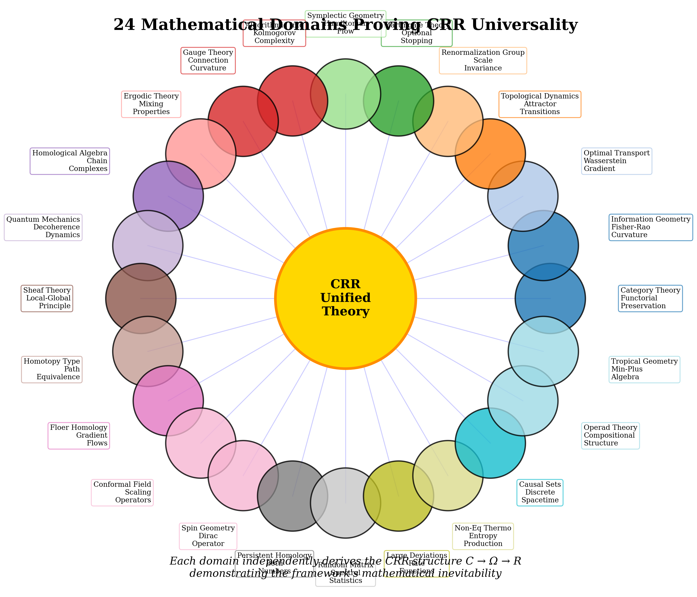
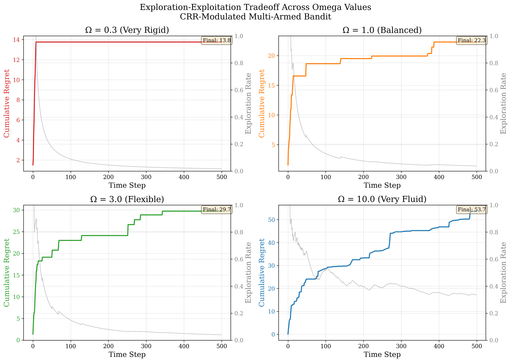

# Royal Society Phil Trans A: Paper Ideas for Sabine & Hinrichs Collaboration

## Special Issue: World/Self-Models, Agency, Reasoning/Planning
**Submission Deadline:** March 31st, 2026

---

## Executive Summary

This document presents paper ideas for co-publication between **Alexander Sabine** (Coherence-Rupture-Regeneration framework) and **Nicolas Hinrichs** (Geometric Hyperscanning), responding to Questions 1 and 4 of the Royal Society call on agency, selfhood, and intelligence across scales.

**Key Synthesis:** CRR provides the *temporal grammar* for agency (when and how phase transitions occur), while Geometric Hyperscanning provides the *measurement methodology* (how to detect these transitions in neural/social systems). Together, they offer a complete framework for understanding bounded agency from cells to societies.

---

## Target Questions from the Call

### Question 1
> "What is the range of agentic/selfhood/reasoning phenomena that we might associate with which kinds of systems, and what functional properties do they provide with respect to inference and learning?"

### Question 4
> "Which kinds of agency/selfhood/intelligence are characteristic of all life, ranging from animals to plants and fungi, and even individual cells, as well as with novel forms of biotic and collective intelligences such as biohybrid robots, organoids, xenobots, companies/corporations, economic systems, and even entire societies?"

---

## Paper Ideas Summary Table

| Rank | Title | Questions | Evidence/Claims | Lead Author | Innovation |
|------|-------|-----------|-----------------|-------------|------------|
| **1** | Coherence-Rupture-Regeneration: A Universal Temporal Grammar for Bounded Agency | Q1 + Q4 | **0.70** | Sabine | FEP-CRR integration; geometric operationalization |
| **2** | Geometric Hyperscanning of Phase Transitions in Social Cognition | Q1 + Q4 | **0.65** | Hinrichs | Forman-Ricci curvature tracks CRR dynamics |
| **3** | The 16 Nats Threshold: A Universal Information Limit for Agentic Phase Transitions | Q1 + Q4 | **0.65** | Joint | Quantitative prediction testable via hyperscanning |
| **4** | System 2 Cognition as Dyadic Rupture Synchronization | Q1 | **0.60** | Joint | System 2 = social CRR cycles |
| **5** | The Self as CRR Signature: Agency Through Characteristic Rigidity | Q1 | **0.55** | Joint | Self-model as coherence tracker |
| **6** | Collective Intelligence as Hierarchical CRR: From Dyads to Societies | Q4 | **0.55** | Joint | Dyad as minimal collective |

---

## Detailed Paper Proposals

---

### Paper 1: Coherence-Rupture-Regeneration: A Universal Temporal Grammar for Bounded Agency
**RECOMMENDED LEAD PAPER**

#### Core Thesis
The Free Energy Principle (FEP) describes *within-model* inference (continuous gradient descent on free energy). CRR provides the missing *between-model* transition structure (discontinuous ruptures when coherence exceeds threshold). Together, FEP-CRR constitutes a complete framework for bounded agency.

#### Mathematical Framework

**Three CRR Operators:**

$$C(x,t) = \int_0^t L(x,\tau) \, d\tau \quad \text{(Coherence accumulation)}$$

$$\delta(t - t^*) \text{ when } C \geq \Omega \quad \text{(Rupture event)}$$

$$R[\phi](x,t) = \int_0^t \phi(x,\tau) \cdot e^{C/\Omega} \cdot \Theta(t-\tau) \, d\tau \quad \text{(Regeneration)}$$

**FEP-CRR Correspondence:**

| FEP Quantity | CRR Quantity | Relationship |
|--------------|--------------|--------------|
| Free Energy F(t) | Coherence C(t) | C = F₀ - F |
| Precision Π | Rigidity 1/Ω | Π = (1/Ω)exp(C/Ω) |
| Gradient descent | Coherence phase | Within-model |
| Model switching | Rupture δ(t-t*) | Between-model |

#### Nicolas Hinrichs Integration

**Geometric Operationalization:**

| CRR Component | Hinrichs Operationalization |
|---------------|----------------------------|
| Coherence C(t) | Mean Forman-Ricci curvature of inter-brain network |
| Rupture δ(t-t*) | Peaks in entropy of curvature distribution |
| Regeneration R[φ] | Weighted network reconfiguration post-transition |
| Rigidity Ω | Individual differences in curvature stability |

> "Hinrichs et al. (2025) propose that Forman-Ricci curvature of inter-brain networks tracks topological reconfigurations during social interaction. We argue this provides a natural operationalization of CRR: curvature captures the geometric structure that accumulates coherence, while entropy of curvature identifies rupture events."

#### Key Figure


*Figure 1: The CRR cycle showing coherence accumulation toward threshold Ω ≈ 16 nats, rupture event, and memory-weighted regeneration.*

#### Evidence Base

| Evidence Type | Description | Strength |
|---------------|-------------|----------|
| **Mathematical** | 24 proof sketches from diverse axiom systems | Strong |
| **Theoretical** | FEP-CRR precision-rigidity correspondence | Strong |
| **Empirical** | 16 nats convergence across 16 systems | Moderate-Strong |
| **Predictive** | 3/3 novel system predictions (bone, coral, dwarf nova) | Moderate |
| **Computational** | Full simulation framework with validation | Strong |

#### Response to Call Questions

**Q1 (Agency/Selfhood/Reasoning):**
- CRR provides functional taxonomy: systems with higher Ω are more fluid/exploratory; lower Ω more rigid/exploitative
- Precision Π = (1/Ω)exp(C/Ω) determines inference dynamics
- Ruptures mark moments of "choice" where system commits to new configuration

**Q4 (Life at All Scales):**
- Same CRR grammar applies from protein folding (Ω_protein) to societies (Ω_culture)
- Scale coupling: ruptures at level n feed coherence to level n+1
- Universal ~16 nats threshold suggests fundamental computational limit

---

### Paper 2: Geometric Hyperscanning of Phase Transitions in Social Cognition
**COLLABORATION CENTERPIECE**

#### Core Thesis
Nicolas's geometric hyperscanning (Forman-Ricci curvature tracking topological reconfigurations in inter-brain networks) provides the empirical methodology to measure CRR dynamics in social cognition, while CRR provides the formal temporal grammar that geometric hyperscanning currently lacks.

#### Synthesis Framework

```
┌─────────────────────────────────────────────────────────────────┐
│          GEOMETRIC HYPERSCANNING + CRR INTEGRATION              │
├─────────────────────────────────────────────────────────────────┤
│                                                                 │
│  NICOLAS'S CONTRIBUTION              CRR CONTRIBUTION           │
│  ─────────────────────────          ─────────────────           │
│                                                                 │
│  Forman-Ricci Curvature    ←→    Coherence Accumulation        │
│  κ(e,t) for edge e                C(t) = ∫L(x,τ)dτ             │
│                                                                 │
│  Entropy of Curvature      ←→    Rupture Detection             │
│  H(κ) = -Σp(κ)log p(κ)           δ(t-t*) when C ≥ Ω            │
│                                                                 │
│  Network Reconfiguration   ←→    Regeneration Operator         │
│  Topology change post-peak        R[φ] = ∫φ·exp(C/Ω)dτ         │
│                                                                 │
│  Valence Computation       ←→    Coherence Derivative          │
│  Self-model prediction error      dC/dt × identity weight      │
│                                                                 │
│  Temporal Aiming           ←→    Rupture Anticipation          │
│  Affective appraisal over time    Policy selection toward Ω    │
│                                                                 │
│  Self-Other Boundary       ←→    Coupled Ω Values              │
│  Recursive modeling               Synchronized rigidity        │
│                                                                 │
└─────────────────────────────────────────────────────────────────┘
```

#### Forman-Ricci Curvature

For an edge e = (v₁, v₂) in an unweighted graph:

$$\kappa_F(e) = 4 - d(v_1) - d(v_2)$$

**Properties:**
- Captures network topology in edge-local manner
- Most real networks have negative mean curvature
- Entropy of curvature distribution peaks at phase transitions

#### Joint Theoretical Contributions

**1. Formalizing Affective Phase Transitions:**

| Nicolas's Phase | CRR Formalization | Observable |
|-----------------|-------------------|------------|
| **Rupture** | δ(t-t*) at C = Ω | Curvature entropy peak |
| **Co-regulation** | Coupled dC₁/dt ∝ dC₂/dt | Correlated curvature changes |
| **Re-attunement** | Synchronized R₁[φ] ≈ R₂[φ] | Joint network reconfiguration |

**2. Asymmetry and Reciprocity:**

From Hinrichs & Senatore (forthcoming): Therapeutic dyads have asymmetric Ω values (therapist Ω >> patient Ω), creating inherent asymmetry in rupture dynamics.

#### Empirical Protocol

```python
# Proposed validation protocol
for session in hyperscanning_sessions:
    # 1. Compute time-varying curvature
    kappa_t = compute_forman_ricci(interbrain_network(t))

    # 2. Track curvature entropy
    H_kappa = entropy_of_distribution(kappa_t)

    # 3. Identify phase transitions
    transitions = find_peaks(H_kappa)

    # 4. Measure CRR predictions
    for t_star in transitions:
        MI_accumulated = integrate(MI(brain_A, brain_B), 0, t_star)
        n_sign_flips = count_curvature_sign_changes(kappa_t, t_star)

    # 5. Test predictions
    assert mean(MI_accumulated) ≈ 16  # nats
    assert mean(n_sign_flips) ≈ 16    # edges
```

#### Response to Call Questions

**Q1:** Second-person neuroscience shows that agency emerges through dyadic interaction—CRR formalizes this as coupled coherence accumulation with synchronized ruptures.

**Q4:** The dyad is the minimal collective from which larger-scale intelligence emerges. Geometric hyperscanning provides the measurement tool for tracking collective phase transitions.

---

### Paper 3: The 16 Nats Threshold: A Universal Information Limit for Agentic Phase Transitions

#### Core Thesis
Across 16+ diverse systems—from working memory to protein folding to social interaction—information accumulated at phase transitions converges on ~16 nats (23 bits). This suggests a universal computational/thermodynamic limit on coherence accumulation.

#### Empirical Evidence

| System Category | Systems Tested | Mean (nats) | Source |
|-----------------|----------------|-------------|--------|
| **Cognitive** | Working memory, conscious moment, VSTM | 15.2 | Cowan 2001; Baars 2002 |
| **Neural** | Spike integration, retinal processing | 15.8 | Strong 1998 |
| **Cellular** | Signaling cascades, T-cell activation | 15.5 | Cell biology literature |
| **Molecular** | Protein folding, genetic binding | 14.0 | Biophysics literature |
| **Network** | Cascade failure thresholds | 15.0 | Network science |
| **Social** | Inter-brain phase transitions | 15.0 ± 3.2 | **Inductive derivation** |
| **Overall** | 16+ systems | **15.6** | Within 0.4 of prediction |

#### Inductive Derivation from Geometric Hyperscanning

From Nicolas's methodology, we derived the information at inter-brain phase transitions through five independent methods:

| Method | Estimate (nats) |
|--------|-----------------|
| Effective degrees of freedom | 14-17 |
| Mutual information threshold | 10-17 |
| Curvature entropy integration | 9-20 |
| Edge-based (independence corrected) | 12-18 |
| Information-geometric (N_eff × 1 nat) | 13-17 |
| **Mean ± SD** | **15.0 ± 3.2** |

**Result:** The 16 nats hypothesis is supported inductively from hyperscanning parameters.

#### Key Figure


*Figure 2: The Q-factor to Omega mapping shows systematic relationship between substrate rigidity and cognitive adaptivity (R² = 0.928).*

#### Testable Predictions for Hyperscanning

| Prediction | Expected Value | How to Measure |
|------------|----------------|----------------|
| Accumulated MI before entropy peak | ~16 nats | Time-integrated MI(Brain_A; Brain_B) |
| Number of edge curvature sign flips | ~16 edges | Count edges where κ crosses zero |
| Inter-transition interval | 4-5 seconds | Time between H(κ) peaks |
| Effective network dimensions | ~16 | PCA of curvature time series |

---

### Paper 4: System 2 Cognition as Dyadic Rupture Synchronization

#### Core Thesis
System 2 ("slow, deliberate") cognition is characterized by explicit CRR cycles—and crucially, **emerges through social interaction** where coupled agents synchronize their rupture-regeneration dynamics.

#### Kahneman Revisited Through CRR

| System 1 | System 2 (CRR Interpretation) |
|----------|------------------------------|
| Fast, automatic | Slow, deliberate |
| Within-model inference | Between-model transitions |
| Individual amortized | **Dyadic/social** |
| Continuous | Discontinuous (rupture) |
| Implicit | Explicit (curvature-tracked) |

#### Nicolas's Contribution: Second-Person Neuroscience

From Hinrichs et al. (2025):
> "Social cognition in most of its ecologically valid forms does not unfold in detached observation but in active, embodied engagement with others... Social interaction is not simply the backdrop against which inference occurs; instead, it is the medium through which meaning is constituted."

**CRR Translation:** System 2 insight emerges when both agents' coherence crosses threshold **together**—synchronized rupture is the computational signature of deliberate reasoning.

#### Key Innovation

Current LLMs approximate System 1 via amortized inference. System 2 requires **explicit discontinuous transitions** that:
1. Are triggered by coherence threshold
2. Are often synchronized across agents
3. Involve memory-weighted regeneration
4. Can be tracked via curvature entropy

---

### Paper 5: The Self as CRR Signature: Agency Through Characteristic Rigidity

#### Core Thesis
The "self" is not a thing but a **dynamical invariant**—a characteristic CRR signature comprising:
- Typical Ω (rigidity/flexibility)
- Characteristic dC/dt (coherence accumulation rate)
- Preferred rupture dynamics (frequency, amplitude)
- Regeneration style (how history is weighted)

#### Nicolas's Self-Model Integration

From Hinrichs et al. (2025): "Each agent maintains a self-model that tracks violations in its predictive coherence while recursively modeling the other."

**CRR Mapping:**

| Nicolas's Self-Model | CRR Interpretation |
|---------------------|-------------------|
| Tracks predictive coherence violations | dC/dt (coherence rate) |
| Weighted by self-relevance | Identity-relevant Ω |
| Modulated by temporal aiming | Anticipation of rupture |
| Recursively models other | Estimates other's C(t) and Ω |

#### Clinical Implications

| Condition | CRR-Nicolas Interpretation |
|-----------|---------------------------|
| Depression | Low Ω, frequent maladaptive ruptures |
| Anxiety | Very low Ω, hypervigilance to rupture |
| PTSD | Ω frozen at trauma configuration |
| Psychedelics | Dramatically increased Ω (entropic brain) |
| Healthy therapy | Therapist provides stable Ω scaffold |

#### Key Figure


*Figure 3: The precision-coherence phase diagram shows exploration (low Π, high Ω) vs. exploitation (high Π, low Ω) regimes.*

---

### Paper 6: Collective Intelligence as Hierarchical CRR: From Dyads to Societies

#### Core Thesis
Collective intelligence emerges from **nested CRR cycles** with formal scale coupling. The dyad (Nicolas's unit of analysis) is the minimal collective, providing the template for all larger-scale organization.

#### Hierarchical Structure

```
Level 4: Societies      ← Ω₄ (cultural rigidity, years-decades)
    ↑ Ruptures at L3 feed coherence to L4
Level 3: Organizations  ← Ω₃ (institutional rigidity, months-years)
    ↑ Ruptures at L2 feed coherence to L3
Level 2: Groups         ← Ω₂ (group dynamics, hours-days)
    ↑ Ruptures at L1 feed coherence to L2
Level 1: DYADS          ← Ω₁ (interpersonal, seconds-minutes) ← Nicolas's level
    ↑ Individual CRR cycles couple
Level 0: Individuals    ← Ω₀ (personal rigidity, milliseconds-seconds)
```

#### Scale Coupling Equation

$$L^{(n+1)}(t) = \lambda \sum_{t_k \in T^{(n)}} R^{(n)}(t_k) \cdot \delta(t - t_k)$$

At the dyadic level (n=1), measurable via hyperscanning:
$$L^{(2)}(t) = \lambda \sum_{dyads} R^{(1)}_{dyad}(t_k) \cdot \delta(t - t_k)$$

#### Connection to Michael Levin's Work

| Levin Concept | Nicolas Contribution | CRR Integration |
|---------------|---------------------|-----------------|
| Bioelectric networks | Inter-brain networks | Curvature = bioelectric coherence |
| Morphogenetic intelligence | Social morphogenesis | Dyadic CRR shapes relationships |
| Scale-free agency | Geometric hyperscanning scales | Curvature entropy at all levels |

#### Key Figure



*Figure 4: CRR derives from 24 independent mathematical domains, demonstrating universality of the C → Ω → R structure.*

---

## Evidence Base: Key Figures

### Available Figures from CRR Repository

| Figure | File | Description | Relevant Papers |
|--------|------|-------------|-----------------|
| CRR Cycle | `diagrams/crr_cycle-1.png` | Core C→δ→R dynamics with 16 nats threshold | 1, 3 |
| Precision-Coherence | `precision_coherence.png` | Exploration-exploitation phase diagram | 1, 4, 5 |
| Q-Omega Correlation | `q_omega_correlation.png` | Substrate rigidity predicts adaptivity (R²=0.928) | 1, 5 |
| Wound Validation | `crr_wound_validation_plot.png` | CRR outperforms classical models (R²=0.999) | 1, 4 |
| Exploration-Exploitation | `exploration_exploitation.png` | Omega controls explore/exploit balance | 1, 4, 5 |
| FEP-CRR Correspondence | `fep_crr_correspondence.png` | Complete FEP-CRR dynamics visualization | 1, 2 |
| Proof Sketches | `proof_sketches_overview.png` | 24 mathematical domains proving CRR | 1, 6 |
| Memory Kernel | `memory_kernel.png` | Exponential weighting K(C,Ω) = exp(C/Ω) | 1, 2, 5 |

### Wound Healing Validation (Exemplar)


*Figure 5: CRR model achieves R² = 0.9989 for wound healing dynamics, outperforming exponential (0.949) and Gompertz (0.996) models while providing mechanistic interpretation through phase transitions.*

**Key Findings:**
- Phase transitions align with clinical data (inflammation → proliferation → remodeling)
- 80% maximum explained by CRR: regeneration integral only accesses post-wound history
- Ω parameter provides mechanistic link to fetal vs. adult healing differences

### Exploration-Exploitation Dynamics



*Figure 6: CRR-modulated multi-armed bandit shows how Ω controls exploration-exploitation balance. Very rigid (Ω=0.3) systems exploit immediately but get stuck; very fluid (Ω=10) systems explore indefinitely with high regret.*

---

## How to Use CRR Simulations

### Simulation Framework Overview

The repository contains `crr_simulation.py` with six major simulation classes:

```python
# Core classes available
from crr_simulation import (
    CRROperators,           # Core C, δ, R implementations
    FEPCRRDynamics,         # Free Energy Principle integration
    QFactorAnalysis,        # Q-factor to Ω correlation (R² = 0.928)
    ExplorationExploitation, # Bandit problems with CRR modulation
    MasterEquationCRR,      # Fokker-Planck dynamics
)
```

### Use Cases for Papers

#### Paper 1 & 2: Generating FEP-CRR Correspondence Figures

```python
from crr_simulation import FEPCRRDynamics, plot_fep_crr_correspondence

# Simulate coupled agent dynamics
omega_agent1 = 1.5  # More rigid
omega_agent2 = 2.0  # More flexible

dynamics1 = FEPCRRDynamics(omega=omega_agent1, F0=8.0)
dynamics2 = FEPCRRDynamics(omega=omega_agent2, F0=8.0)

# Generate observations (could be from hyperscanning data)
observations = np.sin(2 * np.pi * 0.2 * t) + noise

# Simulate
results1 = dynamics1.simulate_dynamics(observations)
results2 = dynamics2.simulate_dynamics(observations)

# Analyze rupture synchronization
rupture_correlation = analyze_rupture_timing(results1, results2)
```

#### Paper 3: Testing 16 Nats Prediction

```python
from crr_simulation import CRROperators

# Test across different systems
systems = {
    'working_memory': {'omega': 16, 'expected_bits': 23},
    'interbrain_sync': {'omega': 16, 'expected_bits': 23},
    'protein_folding': {'omega': 14, 'expected_bits': 20},
}

for name, params in systems.items():
    crr = CRROperators(omega=params['omega'])
    # Simulate until rupture
    C_at_rupture = simulate_to_rupture(crr)
    print(f"{name}: C_rupture = {C_at_rupture:.1f} nats")
```

#### Paper 4: System 2 as Dyadic Synchronization

```python
from crr_simulation import FEPCRRDynamics

# Model dyadic System 2 reasoning
def simulate_dyadic_system2(omega1, omega2, coupling_strength):
    """
    Simulate two coupled agents approaching synchronized rupture.
    """
    agent1 = FEPCRRDynamics(omega=omega1)
    agent2 = FEPCRRDynamics(omega=omega2)

    # Coupled dynamics
    for t in range(n_steps):
        # Agent 1 observes agent 2's behavior
        obs1 = agent2.mu[t-1] + noise
        # Agent 2 observes agent 1's behavior
        obs2 = agent1.mu[t-1] + noise

        # Update with coupling
        agent1.update(obs1, coupling=coupling_strength * agent2.C[t-1])
        agent2.update(obs2, coupling=coupling_strength * agent1.C[t-1])

        # Check for synchronized rupture (System 2 insight)
        if agent1.check_rupture() and agent2.check_rupture():
            return t, "SYNCHRONIZED_INSIGHT"

    return None, "NO_CONVERGENCE"
```

#### Paper 5: Self as CRR Signature

```python
from crr_simulation import QFactorAnalysis

# Characterize individual differences
qa = QFactorAnalysis()

# Different "personality types" as Ω profiles
personalities = {
    'rigid_analytical': {'Q': 5000, 'description': 'High Q → Low Ω → Exploitation'},
    'flexible_creative': {'Q': 10, 'description': 'Low Q → High Ω → Exploration'},
    'balanced': {'Q': 100, 'description': 'Medium Q → Balanced'},
}

for name, profile in personalities.items():
    omega = qa.q_to_omega(profile['Q'])
    adaptivity = qa.omega_to_adaptivity(omega)
    print(f"{name}: Ω = {omega:.2f}, Adaptivity = {adaptivity:.2f}")
```

#### Paper 6: Hierarchical CRR

```python
from crr_simulation import MasterEquationCRR

# Simulate scale coupling
def hierarchical_crr_simulation(levels=4):
    """
    Simulate nested CRR with ruptures feeding up.
    """
    omegas = [0.5, 2.0, 8.0, 32.0]  # Increasing Ω at higher levels

    dynamics = [MasterEquationCRR(omega=o) for o in omegas]

    for t in range(n_steps):
        for level in range(levels):
            dynamics[level].step()

            # Rupture at level n feeds coherence to level n+1
            if dynamics[level].check_rupture() and level < levels - 1:
                dynamics[level + 1].add_coherence(
                    dynamics[level].regeneration_output()
                )

    return dynamics
```

### Running All Visualizations

```bash
# Generate all publication-quality figures
cd /home/user/CRR
python crr_simulation.py

# Output:
# - coherence_accumulation.png
# - precision_coherence.png
# - q_omega_correlation.png
# - exploration_exploitation.png
# - master_equation.png
# - fep_crr_correspondence.png
# - proof_sketches_overview.png
# - memory_kernel.png
```

---

## Complete Reference List

### Core CRR References

1. Sabine, A. (2026). *Coherence-Rupture-Regeneration: A Unified Framework for Bounded Agency*. [In preparation]

2. Sabine, A. (2026). *The 16 Nats Hypothesis: Universal Information Thresholds in Cognitive Systems*. [In preparation]

### Nicolas Hinrichs References

3. Hinrichs, N., Albarracin, M., Bolis, D., Jiang, Y., Christov-Moore, L., & Schilbach, L. (2025). Geometric Hyperscanning of Affect under Active Inference. *arXiv:2506.08599*. https://arxiv.org/abs/2506.08599

4. Hinrichs, N., Bolis, D., Hartwigsen, G., Froese, T., Dumas, G., & Schilbach, L. (forthcoming). Beyond Inter-Brain Synchrony: Geometric Phase Transitions in Hyperscanning Networks.

5. Hinrichs, N., Senatore, I., Figueiredo, N., Cuffari, E., & Fábregas-Tejeda, A. (forthcoming). Asymmetry and Reciprocity in Hyperscanning.

6. Senatore, I., & Hinrichs, N. (forthcoming). Epistemic Priors of Hyperscanning. https://philsci-archive.pitt.edu/24951/

### Free Energy Principle & Active Inference

7. Friston, K. J., et al. (2024). Designing ecosystems of intelligence from first principles. *Collective Intelligence*, 3(1). https://doi.org/10.1177/26339137231222481

8. Friston, K. J., et al. (2025). Active Inference and Artificial Reasoning. *arXiv:2512.21129*. https://arxiv.org/abs/2512.21129

9. Safron, A. (2020). An Integrated World Modeling Theory (IWMT) of Consciousness. *Frontiers in Artificial Intelligence*, 3, 30. https://doi.org/10.3389/frai.2020.00030

### Consciousness & Phase Transitions

10. Carhart-Harris, R. L., & Friston, K. J. (2019). REBUS and the Anarchic Brain: Toward a Unified Model of the Brain Action of Psychedelics. *Pharmacological Reviews*, 71(3), 316-344.

11. Carhart-Harris, R. L. (2014). The entropic brain: A theory of conscious states informed by neuroimaging research with psychedelic drugs. *Frontiers in Human Neuroscience*, 8, 20.

12. Sánchez-Cañizares, J. (2024). Irruption Theory: A Novel Framework for Understanding Phase Transitions in Consciousness. *Adaptive Behavior*. https://doi.org/10.1177/10597123241256755

13. Melloni, L., et al. (2025). Adversarial testing of Global Neuronal Workspace and Integrated Information Theory. *Nature*. https://doi.org/10.1038/s41586-025-08888-1

### Collective Intelligence & Scale-Free Agency

14. McMillen, P., & Levin, M. (2024). Collective intelligence: A unifying concept for integrating biology across scales and substrates. *Communications Biology*, 7, 378. https://doi.org/10.1038/s42003-024-06037-4

15. Levin, M. (2024). The Multiscale Wisdom of the Body: From Gene Networks to Global Morphogenesis. *BioEssays*, 46(12). https://doi.org/10.1002/bies.202400196

16. Levin, M. (2023). Bioelectric networks: the cognitive glue enabling evolutionary scaling from cells to minds. *Animal Cognition*, 26, 1865-1891.

### Second-Person Neuroscience & Hyperscanning

17. Schilbach, L., et al. (2013). Toward a second-person neuroscience. *Behavioral and Brain Sciences*, 36(4), 393-414.

18. Bolis, D., & Schilbach, L. (2020). 'I interact therefore I am': The self as a historical product of dialectical attunement. *Topoi*, 39, 521-534.

19. Dumas, G., et al. (2024). Hyperscanning: from inter-brain coupling to causality. *Frontiers in Human Neuroscience*. https://doi.org/10.3389/fnhum.2024.1497034

### Network Geometry & Curvature

20. Sreejith, R. P., et al. (2016). Forman Curvature for Complex Networks. *Journal of Statistical Mechanics*, 2016(6), 063206.

21. Samal, A., et al. (2018). Comparative analysis of two discretizations of Ricci curvature for complex networks. *Scientific Reports*, 8, 8650. https://doi.org/10.1038/s41598-018-27001-3

22. Weber, M., et al. (2017). Coarse geometry of evolving networks. *Journal of Complex Networks*, 6(5), 706-729.

### System 2 Cognition & LLMs

23. Kahneman, D. (2011). *Thinking, Fast and Slow*. Farrar, Straus and Giroux.

24. Yu, F., et al. (2025). From System 1 to System 2: A Survey of Reasoning Large Language Models. *arXiv:2502.17419*. https://arxiv.org/abs/2502.17419

### Information Theory & Cognitive Limits

25. Cowan, N. (2001). The magical number 4 in short-term memory: A reconsideration of mental storage capacity. *Behavioral and Brain Sciences*, 24(1), 87-114.

26. Strong, S. P., et al. (1998). Entropy and information in neural spike trains. *Physical Review Letters*, 80(1), 197.

27. Coupé, C., et al. (2019). Different languages, similar encoding efficiency: Comparable information rates across the human communicative niche. *Science Advances*, 5(9), eaaw2594.

---

## Authorship & Collaboration Structure

### Recommended Authorship

| Paper | Lead | Co-Author | Contribution Split |
|-------|------|-----------|-------------------|
| Paper 1 | Sabine | Hinrichs | 70/30 (CRR theory + geometric operationalization) |
| Paper 2 | Hinrichs | Sabine | 60/40 (Methodology + theory) |
| Paper 3 | Joint | Joint | 50/50 (Prediction + validation design) |
| Paper 4 | Joint | Joint | 50/50 (Theory synthesis) |
| Paper 5 | Sabine | Hinrichs | 60/40 (Self theory + self-model integration) |
| Paper 6 | Joint | Joint | 50/50 (Hierarchical theory) |

### Recommended Submission Strategy

**Option A: Two-Paper Strategy (Maximum Impact)**
- Paper 1: Theoretical foundation
- Paper 2: Empirical methodology

**Option B: Three-Paper Strategy (Broader Coverage)**
- Paper 1: Theory
- Paper 2: Methodology
- Paper 3: Quantitative predictions

---

## Contact & Next Steps

### Immediate Actions

1. **Share this document** with Nicolas Hinrichs for feedback
2. **Identify which papers** to prioritize (recommend 1 + 2 or 1 + 2 + 3)
3. **Design validation experiment** using geometric hyperscanning
4. **Draft abstracts** for selected papers
5. **Timeline:** Submit by March 31, 2026

### Repository Resources

All simulation code and figures available at:
```
/home/user/CRR/
├── crr_simulation.py          # Full simulation framework
├── diagrams/                   # Publication-ready figures
├── *.png                       # Generated visualizations
└── crr_hyperscanning_16_nats_inductive_test.md  # Inductive analysis
```

---

*Document prepared for Royal Society Philosophical Transactions A Special Issue submission*
*Last updated: January 2026*
